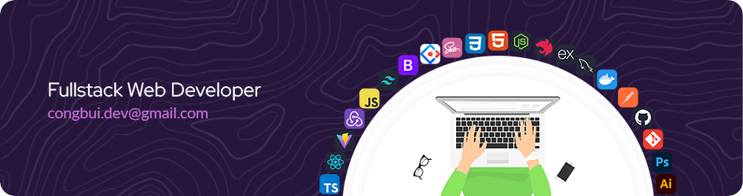

<h1 align="center">Hi 👋, I'm <a href="javascript:void(0)" target="_blank">BUI HUU CONG</a></h1>
<h5 align="center"> passionate fullstack web developer from HCMC, Vietnam</h5>

## Profile Views:

<table>
    <tr>
        <th>Total Count</th>
    </tr>
    <tr>
        <td>
            
        </td>
    </tr>
</table>

## Languages, Tools I Know:

### Front-End

<!--      -->
    

### Back-End

    

### Tool and ...

    

## Top Respositories:

    
    
    
    
    

